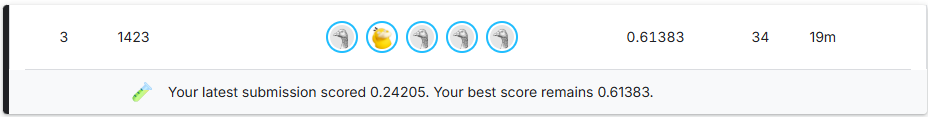

# 💊 경구약제 이미지 객체 검출(Object Detection) 프로젝트
 
이 프로젝트는 Sprint AI14기 Part2 3팀의 Basic Project 입니다  
이번 프로젝트의 목표는 사진 속에 있는 최대 4개의 알약의 이름(클래스)과 위치(바운딩 박스)를 검출하는 것입니다.

## 👥 멤버

🏷️ 팀명 **1423**
| 이름 | 역할 | GitHub |
|------|------|--------|
| 서동현 | Project Leader | [@headache404](https://github.com/headache404) |
| 김원태 | Experimentation Lead | [@andyKim0313](https://github.com/andyKim0313) |
| 김주희 | Data Engineer | [@juhee4839](https://github.com/juhee4839) |
| 이석우 | Experimentation Lead | [@SUKWOOLEE-249](https://github.com/SUKWOOLEE-249) |
| 조영권 | Model Architect | [@Young9won](https://github.com/Young9won) |

---
 
## 📌 프로젝트 설명
 
- **이미지 인식 기술을 헬스케어 분야에 접목해보는** 프로젝트 입니다.
- 헬스케어 스타트업 : 헬스잇(Health Eat) 의 AI 엔지니어링 팀이라고 가정 합니다.
    - AI 엔지니어링 팀은 유저가 본인의 모바일 애플리케이션으로 자신이 복용중인 약 사진을 찍었을 때, 이미지 인식을 통해 해당 약에 대한 정보를 확인할 수 있는 모델을 만들어야하는 미션을 부여받았습니다.
    - 기업에서는 이를 통해 유저의 건강 상태 및 함께 복용하면 안되는 약 등 헬스케어 정보를 유저들에게 제공 합니다.
- 사진 속에 있는 최대 4개의 알약의 이름(클래스)과 위치(바운딩 박스)를 검출하는 모델을 구현하고, 성능을 지속적으로 개선해나가는 것이 프로젝트의 목표입니다.

---

## 📂 프로젝트 구조
 
```
project/
├── data/
│   ├── images/                     # train, val, test image
│   ├── labels/                     # 이미지 1장당 라벨 1개(yolo_labels)
│   ├── coco_annotations/           # train, val json
├── docs/                           # 결과 및 보고서
├── models/                         # 모델 정의
├── notebooks/                      # 데이터 탐색을 위한 노트북
├── result/                         # 모델 결과 CSV 파일
├── sprint_ai_hub/                  # AI_HUB 추가 데이터
├── sprint_ai_project1_data/        # 기존 제공 된 데이터
├── utils/                          # 데이터 로딩 유틸리티
├── main.py                         # 메인 실행 스크립트
├── merge_aihub_class.py            # 기존 제공 된 데이터에 AI_HUB 데이터 병합
├── clean_bbox.py                   # AI_HUB 데이터 전처리
├── environment.yml                 # conda 설치 패키지 목록
└── README.md
```
 
## ⚙️ 실행 방법

**1. Image, Json 파일 위치**
```
sprint_ai_project1_data/
├── test_images/
├── train_annotations/
└── train_images/

sprint_ai_hub/
├── train_annotations/
│   └── TL1 ~ TL8/
└── train_images/
    └── TL1 ~ TL8/
```

**2. 필요한 패키지 설치**
```bash
# conda 가상 환경을 사용하므로 environment.yml을 사용하여 통일 하면 되지만 아래 사항은 확인 후 진행 해야 함
# nvidia-smi, check_cuda.py 실행 하여 cuda 버전 확인 후 설치. cu121 부분이 버전!
pip install torch torchvision --index-url https://download.pytorch.org/whl/cu121
pip install ultralytics albumentations

# 없다면 
pip install torch torchvision ultralytics albumentations
```
 
**3. 모델 학습 및 평가**
```bash
# 1. 기존 제공 데이터 전처리 및 image, json, txt 생성
python main.py --preprocess                 # 전처리 진행

# 2. AI HUB 데이터 반영
python merge_aihub_class.py                 # AI_HUB 데이터 반영
python clean_bbox.py                        # 전처리 진행

# 3. 모델 실행
python main.py --skip --model yolo          # 전처리 생략 후 모델 실행 
```

---
 
## 📊 결과 및 보고서
 
**1. 최종 Kaggle Score**
- 

**2. 발표자료 및 보고서**
- **[발표자료](./docs/1423_AI%20초급%20프로젝트%20최종%20발표%20-%20경구약제%20객체%20검출_v1.1.pptx)**
- **[보고서](./docs/1423_AI%20초급%20프로젝트%20보고서%20-%20경구약제%20객체%20검출_v1.2.pdf)**

---
 
## 📋 협업일지
 
| 이름 | 링크 |
|------|--------|
| 서동현 | [Notion](https://app.notion.com/p/Daily-3-3d7c6ae3c19f8049b691cee55a60a629) |
| 김원태 | [Notion](https://app.notion.com/p/3d81cf152dad80aabb74cb081d791a56?v=3d81cf152dad80e7b737000ce0dc7de3&source=copy_link) |
| 김주희 | [Notion](https://app.notion.com/p/3d7c253c1db580fd95a1f94e6a38e075?v=3ddc253c1db580bd9391000ceb6ffac8&source=copy_link) |
| 이석우 | [Notion]() |
| 조영권 | [Notion](https://app.notion.com/p/3a480ec7c5ee8032b2e1cc82f6a97eab?source=copy_link) |
 
---
 
## 📝 참고 사항
 
- Image, json, txt, csv 파일은 별도 업로드 하지 않습니다